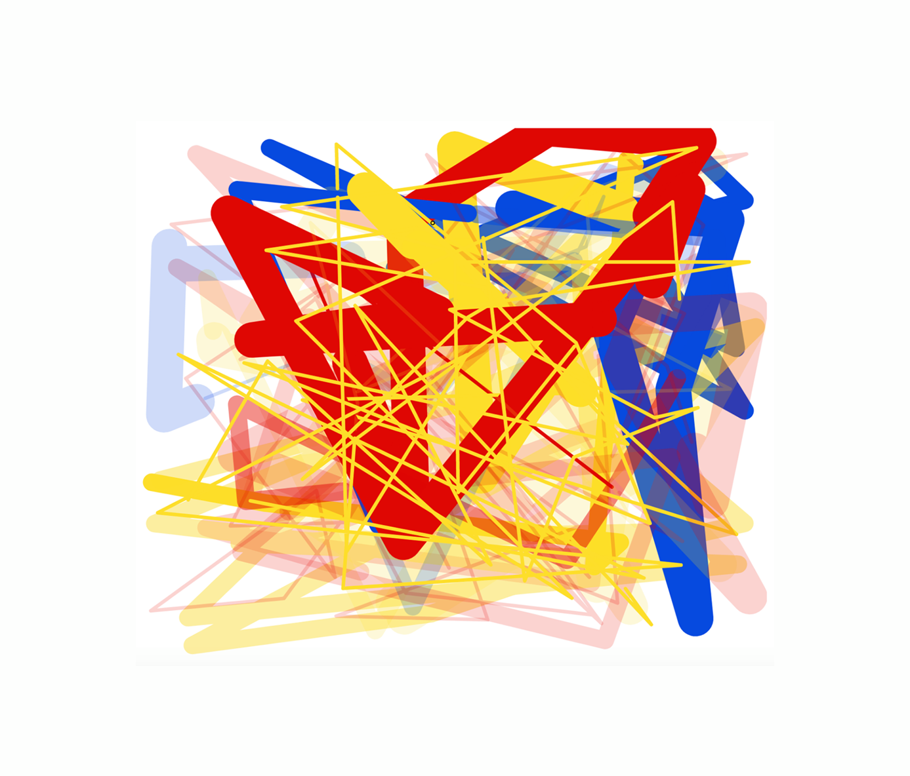

# Expanded Ideas For Drawing
As a final project for my Art class, I made an interactive web experience that exposes a voice UI for someone to create a drawing. View the live version [here](https://abizzaar.github.io/speech-draw/).

### Motivation
People use Voice UI, through technologies like Siri and Alexa, to get things done efficiently. "Siri, set an alarm for 9AM". "Alexa, play The Beatles". I wanted to explore what it meant to use a voice UI for a more abstract task like creating a drawing.

### Considerations
I wanted to find the right balance between giving the user control over the drawing and making it algorithmic. There were two paths I could go down for the voice interactions: 
* Having voice map to specific commands (eg: "draw a blue line")
* Analyzing voice using NLP to create drawings (eg: "Tame Impala is my favorite band because...")

I tested out different iterations of the design concept (on paper and on my laptop) with my friends, and made notes on how interesting, engaging and thought-provoking the concepts were. I developed the final concept based on the feedback.

### Technologies used
[Paper.js](http://paperjs.org/) and [Artyom.js](https://sdkcarlos.github.io/sites/artyom.html)

### Voice Commands
The commands below trigger changes in the experience. For example, I could say "Start" to start drawing, "Blue" to change the color, and "Large" to increase line thickness.

| Category      | Commands      |
| ------------- |---------------| 
| Drawing       | Start, Stop   |
| Colors        | Red, Yellow, Blue  |
| Line Thickness | Small, Medium, Large   | 
| Line Opacity  | Faint, Light, Dark   | 

### Limitations
Browser support and device compatibility is not great. It's only guaranteed to work with Google Chrome on laptop and desktop. Make sure to "Allow" the website to use your microphone, and that no other open tab or window is already using the microphone.

### Future Steps
To continue this exploration, I hope to keep refining my artistic intention and execution of the concept, and add more features. Specific things I will consider is how much control users want over the line drawing, adding support for drawing specific shapes and objects, and adding more line textures.
